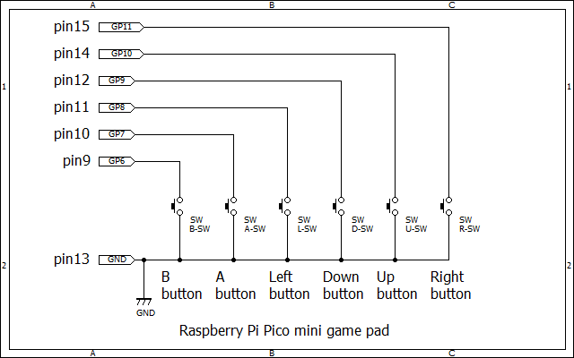

# NTSC composite video test programs for Raspberry Pi Pico
I've implemented some test programs for Raspberry Pi Pico to generate NTSC composite video output.

## Connection from Raspberry Pi Pico to RCA pin jack
GPIO14(pin19) -> 330ohm resister -> RCA+

GPIO15(pin20) -> 1kohm resister -> RCA+

GND(pin23) -> RCA-

## Mini game pad with tact switches

## Demo programs
* test_ntsc.c:  Basic test for NTSC signal generation.

* test_ntsc_lifegame.c:  Life game with NTSC video output.

* test_ntsc_shot.c:  Tiny game named "FLYING METEOR!!".

* test_ntsc_shot2.c:  Tiny game named "FLYING METEOR 2!!".

* test_ntsc_wall.c: Tiny game named "DROPPING MONSTERS".

All programs need font8x8_basic.h to draw ASCII fonts and some characters and are compiled with release option(speed optimization).

## To compile a project
To copile a project, you need

* CMakeLists.txt, 
* pico_sdk_import.cmake, 

other than source and header files.

## CMakeLists.txt
In CMakeLists.txt, you need to edit 'test_ntsc' as proper name to compile project.
